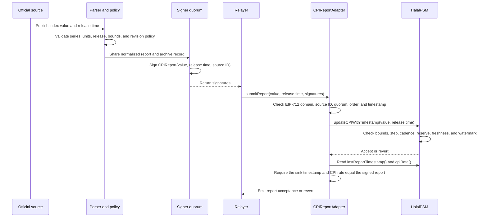

# CPI adapter specification

Status: design requirement for a production deployment. This document does not approve a
provider, an oracle product, or a deployment. The reference contracts remain unaudited.

## Purpose

`HalalPSM` accepts a CPI report through `updateCPIWithTimestamp(uint256,uint256)`. The PSM checks
the report's numeric bounds, movement, cadence, reserve impact, timestamp ordering, and age. It
does not identify the statistics agency that produced the number.

An adapter or relayer must supply that missing boundary. The implementation must authenticate the
report source before it calls the PSM and must preserve the source publication timestamp.

## Required topology

```text
official CPI publication
        |
        v
source parser and policy checks
        |
        v
reviewed consumer or relayer  ---- governance-managed UPDATER_ROLE ---->  HalalPSM
        |
        +---- report archive, transaction hash, and monitoring records
```

The adapter may use a Chainlink Functions consumer, a separately operated relayer, or another
reviewed mechanism. The choice belongs in the deployment journal. The adapter must not change the
PSM's accounting, reserve rules, or emergency governance path.

## Submission sequence

The source publisher, parser, signer quorum, relayer, and PSM each own a separate boundary. The
sequence below shows which component supplies each fact and where the on-chain checks apply.



The adapter authenticates the signer quorum. The parser and deployment policy establish what the
signers approved. The PSM enforces economic and timing constraints. A successful transaction does
not prove that the official source reported the value correctly.

## Report contract

The adapter submits:

```solidity
updateCPIWithTimestamp(uint256 reportedCPI, uint256 reportedAt)
```

The deployment policy must define these fields before it grants `UPDATER_ROLE`:

| Field | Required meaning |
| --- | --- |
| `reportedCPI` | The source's CPI value converted to `CPI_PRECISION` units. `1_000_000` means 1.0. |
| `reportedAt` | A nonzero source publication timestamp in Unix seconds, not the relayer submission time. |
| source identity | The agency, index series, geography, release calendar, and source URL. |
| revision policy | Whether a revised publication can replace an accepted report and how governance approves it. |
| unit policy | The exact source units, scaling, rounding, and missing-value behavior. |

The adapter must reject a response when it cannot establish the source identity, publication time,
units, or value. It must not substitute the current block timestamp for a missing source timestamp.

## Trust assumptions

The deployment journal must name an owner for each assumption:

Use the provider-neutral [`CPI source-policy record`](CPI-SOURCE-POLICY-TEMPLATE.md) as a
copy-paste starting point for this evidence. It must be completed before granting the adapter's
`UPDATER_ROLE` and linked from the deployment journal.

| Boundary | Required control | Evidence to retain |
| --- | --- | --- |
| Source authenticity | Fetch only the documented official series over an authenticated transport or a reviewed oracle service. | Raw response, source URL, retrieval time, parser version, and hash. |
| Parser correctness | Version the parser and test malformed, missing, duplicate, revised, and out-of-range fields. | Reproducible fixtures and test output. |
| Report authorization | Restrict the adapter's submission path to the intended consumer or signer set. | On-chain role state, custody policy, and rotation records. |
| Freshness | Enforce the source heartbeat off-chain and rely on the PSM's 90-day maximum age on-chain. | Alert history and accepted report events. |
| Key rotation | Prepare the replacement before revoking the current updater and verify the first report from the replacement. | Governance proposal, role events, and transaction hashes. |
| Source changes | Change `source` and the updater through a reviewed governance action before accepting the new series. | Proposal calldata, source metadata, and deployment journal entry. |

The PSM's `source` string records operator metadata. It does not authenticate a report. Monitoring
must compare it with the expected deployment record using
[`scripts/check-psm-health.sh`](../scripts/check-psm-health.sh).

### Reviewer checklist before a governed handoff

Do not approve the `UPDATER_ROLE` grant or source-label update until every item below has a
named evidence link. A green on-chain health result is necessary, but it cannot replace source,
parser, or custody review.

- [ ] The PSM `source()` label exactly matches the policy record and the deployment-registry
      `cpiSource` value; it identifies the intended series without implying authentication.
- [ ] The adapter `sourceId` is derived from the documented source identity and parser policy, and
      matches the policy record, typed-data payload, and deployment-registry `cpiSourceId`.
- [ ] The policy record names the publisher, series, units, timezone, publication timestamp field,
      cadence, freshness limit, revision behavior, fallback, and owner.
- [ ] Parser fixtures cover malformed, missing, duplicate, revised, out-of-range, and unexpected
      source data; the exact parser commit and raw-response hash are recorded.
- [ ] The adapter owner is the intended timelock, the signer set and threshold are independently
      reviewed, and no signer overlaps the owner or relies on undocumented custody.
- [ ] The zero-value handoff calldata grants the adapter before revoking the old updater, changes
      the source label, and contains no unrelated action; offline preflight passes.
- [ ] Before and after the first report, the operator records role events, adapter/PSM CPI values and watermarks,
      health output, report transaction, and the deployment journal entry.
- [ ] A source or parser change is treated as a new review: prepare the replacement, verify its
      first report, then revoke the old updater; do not use `mockCPI` as an unreviewed fallback.

## Failure behavior

The adapter and operator must apply these rules:

1. A missing, malformed, delayed, or disputed source report produces no PSM update.
2. A stale watermark causes the PSM to reject new deposits. Existing valid redemption credits
   remain subject to reserve and accounting checks.
3. An adapter outage does not trigger an automatic fallback to an unreviewed source.
4. Governance may use `mockCPI` for an explicit emergency correction. The proposal must record the
   reason, value, reserve impact, source evidence, and follow-up action.
5. A compromised updater must be revoked through the timelock. Operators must preserve report and
   custody evidence for incident review.

6. A sink call that returns successfully but does not set both `lastReportTimestamp` and `cpiRate`
   to the submitted report is rejected by the adapter. This keeps `lastSubmittedTimestamp` from
   claiming acceptance when the configured sink is a no-op, incompatible, or rate-mismatching
   contract.

The adapter must not treat a successful transaction as proof that the source was correct. The PSM
only proves that the report satisfied its on-chain constraints.

## Reference module

The repository includes [`CPIReportAdapter.sol`](../contracts/src/CPIReportAdapter.sol) as an
optional reference module. It uses the EIP-712 domain `Halal CPI Report Adapter`, version `1`, and
the typed data:

```text
CPIReport(uint256 reportedCPI,uint256 reportedAt,bytes32 sourceId)
```

The submitter must provide exactly `threshold` signatures, ordered by recovered signer address in
strictly ascending order. The adapter rejects future or non-increasing publication timestamps,
tracks the last forwarded timestamp, binds each signature to the adapter's immutable `sourceId`,
and protects its PSM call with a reentrancy guard. `Ownable2Step` controls signer rotation and
threshold changes. The signer set is capped at `MAX_SIGNERS = 64` so governance cannot expand
signature verification until reports exceed practical block-gas limits; production deployments
should use the smallest independently governed quorum that meets their custody policy. The owner
must remain outside the signer set; set it to the protocol timelock before granting the adapter
`UPDATER_ROLE` on the PSM.

`getSigners()` exposes the current signer set for deployment verification and `signerAt(index)`
supports low-bandwidth monitoring. The array preserves configuration order when signers are added;
removing a signer may move the last entry into the removed slot, so consumers must compare it as a
set. Record the returned addresses, threshold, owner, and source ID in the deployment journal and
recheck them after each governance rotation.

The module authenticates the configured signer quorum. It does not prove that those signers parsed
an official CPI source correctly. Operators still need the source policy, parser review, report
archive, and independent security review described below.

### Deployment command

The repository includes a chain-guarded deployment script. It deploys the adapter and leaves the
PSM role unchanged so governance can review the constructor output first:

```shell
cd contracts
PRIVATE_KEY=0x... EXPECTED_CHAIN_ID=421614 \
PSM=0x... ADAPTER_OWNER=0x<timelock> \
CPI_SOURCE_ID=0x... CPI_THRESHOLD=2 \
CPI_SIGNER_1=0x... CPI_SIGNER_2=0x... CPI_SIGNER_3=0x... \
forge script script/DeployCPIReportAdapter.s.sol:DeployCPIReportAdapter \
  --rpc-url "$RPC_URL" --private-key "$PRIVATE_KEY" --broadcast
```

`CPI_SIGNER_3` is optional. The script rejects a zero private key, a zero or mismatched chain ID, a
PSM address without contract bytecode, an adapter owner without contract bytecode, a deployer-owned
adapter, zero or duplicate signer addresses, signer addresses equal to the deployer or adapter owner,
a zero source ID, and an impossible
threshold before broadcasting. The adapter constructor and ownership rotation retain the same
custody-separation defense. Record the output,
source-ID derivation, commit, and deployment transaction in the deployment journal.

### Governance wiring

1. Deploy the adapter with the PSM address, timelock owner, signer set, threshold, and a nonzero
   `sourceId` derived from the documented source series and parser policy.
2. Verify the EIP-712 domain, source ID, signer addresses, threshold, and owner before any report
   is signed.
3. Grant the adapter `UPDATER_ROLE` through the PSM's governance path.
4. Set the PSM `source` metadata through governance and record the expected value in the deployment
   journal.
5. Submit a fresh test report, verify `CPIUpdated` and `CPIReportAccepted`, and run the combined
   deployment health check with `CPI_UPDATER` and `EXPECTED_CPI_SOURCE`.
6. Treat a source-series or parser-policy change as a new adapter deployment. Revoke the old
   adapter's PSM role only after the new adapter passes its first-report and health checks.
7. Review signer additions, removals, threshold changes, and owner transfers as governance actions.

The repository includes `script/PrepareCPIAdapterHandoff.s.sol` to prepare the grant, source update,
and optional old-updater revocation as zero-value DAO actions. The script requires `PSM`,
`CPI_ADAPTER`, `TIMELOCK`, `CPI_SOURCE`, and `EXPECTED_CPI_SOURCE_ID`; it checks the adapter's
immutable PSM binding, owner, and source ID, then prints calldata without broadcasting. Review the
signer set and threshold separately before submitting the returned arrays. The shared handoff builder
also rejects zero addresses and refuses to encode a proposal that grants `UPDATER_ROLE` to the adapter
and then revokes that same adapter as the old updater; it also rejects an empty PSM source label.
The PSM itself also rejects empty or whitespace-only `setSource` values, so governance cannot clear
the source label after the adapter handoff.

### Signature verification

After each signer returns a signature, verify the typed data and recovered addresses before
submitting the report:

```shell
node scripts/verify-cpi-report.mjs \
  --typed-data /path/to/typed-data.json \
  --rpc-url "$RPC_URL" --adapter 0x<adapter> \
  --signers 0x<lowest-signer>,0x<next-signer> \
  --signatures 0x<signature-for-lowest>,0x<signature-for-next>
```

Read the signer addresses from the deployment health output or `CPIReportAdapter.getSigners()`.
The verifier reads the live adapter's chain ID, PSM binding, source ID, threshold, signer set, submitted CPI,
and report watermark through the RPC. It also reads the PSM's CPI rate, report watermark, freshness window, and
current block time. It rejects stale, replayed, future, or already-consumed reports before it
recovers signatures. The tool keeps private keys out of the process, requires one 65-byte signature
per configured signer in strict address order, and delegates EIP-712 recovery to Foundry's
`cast wallet verify`.

The module remains unaudited. A deployment must not treat the presence of this source file or its
tests as an approval to accept meaningful funds.

### Local adapter rehearsal

For a copy-paste explanation of the report lifecycle, see the
[`local CPI report walkthrough`](LOCAL-CPI-REPORT-WALKTHROUGH.md).

Run `make adapter-demo` to deploy a disposable PSM and adapter on Anvil chain `31337`, grant the
adapter `UPDATER_ROLE` inside the local harness, sign a two-of-two EIP-712 report, and run the
read-only health check, including signer enumeration, then verify a separately prepared quorum
payload against the live adapter. The harness bypasses DAO execution to keep the rehearsal short;
it must not be used as a public deployment or as evidence that a production governance handoff has
executed.

## Monitoring requirements

Run the combined audit with the deployment's expected updater and source:

```shell
RPC_URL=https://... EXPECTED_CHAIN_ID=421614 \
TIMELOCK=0x... TOKEN=0x... TEAM_VESTING=0x... TREASURY_VESTING=0x... \
DAO=0x... PSM=0x... RESERVE_TOKEN=0x... \
TEAM_BENEFICIARY=0x... TREASURY_BENEFICIARY=0x... DEPLOYER_ADDRESS=0x... \
CPI_UPDATER=0x... CPI_ADAPTER=0x... \
EXPECTED_CPI_ADAPTER_OWNER=0x<timelock> \
EXPECTED_CPI_SOURCE='BLS:CUUR0000SA0' EXPECTED_CPI_SOURCE_ID=0x... \
./scripts/check-deployment-health.sh
```

Alert on these conditions:

- `timestamped_cpi_report_missing`;
- `timestamped_cpi_report_stale`;
- `reserve_deficit`;
- `configured_cpi_updater_missing_role`;
- `cpi_source_mismatch`;
- `cpi_adapter_psm_mismatch`;
- `cpi_adapter_source_id_mismatch`;
- `cpi_adapter_quorum_invalid`;
- `cpi_adapter_signer_owner_overlap`;
- `cpi_adapter_signer_duplicate`;
- `cpi_adapter_watermark_mismatch`;
- overdue normal CPI cadence;
- unexpected `RoleGranted`, `RoleRevoked`, or `SourceUpdated` events.

The operator must retain the source response, parser version, report timestamp, CPI value, PSM
transaction hash, and the health-check output for each accepted report. The BLS parser includes
`source.responseSha256`, the SHA-256 of the exact input response bytes, so the normalized report can
be paired with the archived source artifact without relying on JSON reserialization.
The adapter reads the sink's public `lastReportTimestamp()` and `cpiRate()` after every forwarded
report and only updates `lastSubmittedTimestamp` and `lastSubmittedCPI` when both equal the submitted report. The adapter
and sink values must remain aligned; a mismatch indicates a different updater, an incomplete
handoff, or an unexpected state transition that requires investigation.

## Acceptance tests

Before a deployment grants `UPDATER_ROLE`, the adapter contribution must include:

- unit tests for valid reports and the exact source-to-`CPI_PRECISION` conversion;
- rejection tests for missing fields, malformed values, wrong units, duplicate timestamps,
  future timestamps, stale timestamps, revisions, and unauthorized submissions;
- integration tests that exercise `updateCPIWithTimestamp` and the PSM's bounds, step, cadence,
  reserve, and freshness checks;
- key-rotation tests covering grant, first successful report, and revoke;
- monitoring tests covering an absent role and a mismatched source label;
- a local-demo or fork test that records the report archive and transaction hash;
- an independent security review of the adapter, parser, custody path, and deployment policy.

The contribution must document the exact commands and tool versions used to run these tests.

### Evidence map

Reviewers can start with the smallest relevant test or command instead of reading the repository
in deployment order.

| Boundary | Evidence | Reproduction |
| --- | --- | --- |
| EIP-712 domain and source binding | Chain ID, source ID, replay, future timestamp, and signature-order tests | `cd contracts && forge test --match-contract CPIReportAdapterTest` |
| Signer custody and quorum changes | Rotation, removal, threshold, enumeration, and unauthorized-signer tests | `cd contracts && forge test --match-path test/CPIReportAdapter.t.sol` |
| PSM acceptance boundary | Bounds, cadence, timestamp, reserve, and stale-report tests | `cd contracts && forge test --match-contract HalalPSMTest` |
| Accounting invariants | Credit conservation, token supply, and reserve collateralization invariants | `cd contracts && forge test --match-contract HalalPSMInvariantTest` |
| Source parser | Series identity, integer conversion, malformed input, and timestamp tests | `node --test scripts/test/*.test.mjs` |
| End-to-end handoff | Two-of-two signing, live adapter verification, and watermark checks | `make adapter-demo` |

These checks provide review evidence. They do not constitute an independent security audit.

## Report preparation and signing

Use [`scripts/prepare-cpi-report.mjs`](../scripts/prepare-cpi-report.mjs) to normalize a source
release. It rejects floating-point input, values outside the PSM range, future timestamps, malformed
addresses, and malformed source IDs:

```shell
node scripts/prepare-cpi-report.mjs \
  --input report.json --typed-data-out typed-data.json
```

The input must contain `chainId`, `adapter`, `sourceId`, `cpi` as a decimal string, and `reportedAt`
as the source publication timestamp. See
[`scripts/test/cpi-report.example.json`](../scripts/test/cpi-report.example.json) for the shape.
Each authorized signer can sign the same typed-data file through the custody system. For a local
development key, Foundry can produce an EIP-712 signature with:

```shell
cast wallet sign --data --from-file typed-data.json --private-key "$SIGNER_KEY"
```

The operator must recover each signature, sort signatures by signer address, and verify the source
ID and adapter address before submitting the exact quorum to `submitReport`. Keep the raw source
release, normalized report, typed-data file, signer identities, and submission transaction together
in the report archive. Never place a production signer key in the repository or shell history.

## Reference source profile: U.S. CPI-U

The repository includes a parser for the BLS CPI-U all-items series `CUUR0000SA0`, which [BLS
identifies](https://www.bls.gov/cpi/factsheets/cpi-series-ids.htm) as the all-items U.S. city average
for all urban consumers, not seasonally adjusted. The [official API](https://www.bls.gov/developers/api_signature_v2.htm)
exposes the series ID, monthly period, and index value through its latest-series endpoint. It does
not supply the source publication timestamp required by the PSM, so the operator must copy that
timestamp from the archived BLS release record and retain both records together.

Fetch the latest series response from the official API, then convert the raw index into the protocol
ratio using the deployment's documented base index:

```shell
curl --fail --silent --show-error \
  'https://api.bls.gov/publicAPI/v2/timeseries/data/CUUR0000SA0?latest=true' \
  > bls-cpi-response.json

node scripts/parse-bls-cpi.mjs \
  --input bls-cpi-response.json \
  --output cpi-report.json \
  --base-index 300.000 \
  --chain-id 421614 \
  --adapter 0x... \
  --source-id 0x... \
  --reported-at "$BLS_RELEASE_TIMESTAMP"
```

The parser accepts one point marked `latest=true` for the exact series, rejects preliminary and
revision-marked (`R`) footnotes pending explicit policy review, computes
`rawIndex / baseIndex * 1_000_000` with integer half-up rounding, and then applies the PSM's
`[0.1, 2.0]` range. Include the series ID, base index, rounding rule, and parser version in the
source ID and deployment journal. The base index becomes part of the protocol's economic policy;
changing it requires a new source ID and adapter review.

The BLS profile provides a reproducible source parser. It does not settle the deployment's revision
policy, release-calendar monitoring, signer custody, or independent review requirements.

## Open decisions for the implementer

The following choices require a written deployment decision before implementation:

- the official CPI series and its revision policy;
- a single-source or multi-source quorum model;
- the consumer or signer architecture;
- the source heartbeat and alert lead time;
- the emergency correction process;
- the chain-specific transaction sponsor and key custody system.

See [issue #17](https://github.com/fredrikblau/halal-protocol/issues/17) for the contribution scope.
